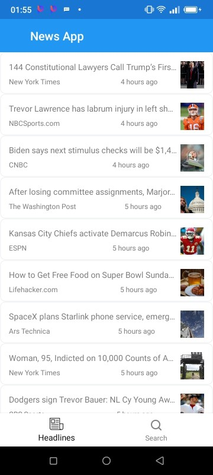
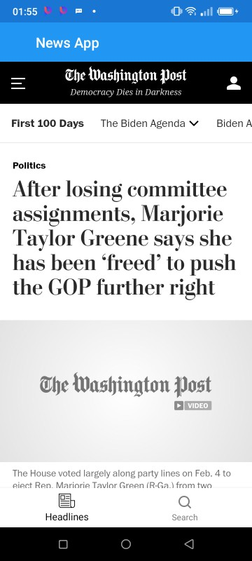

# News App

A demo news app to display latest news and headlines. It also allows the user to bookmark their favourite news.

# Project Overview

## Architecture

This project strictly follows the mvvm Software Architectural Pattern.

MVVM(Model–View–ViewModel) is an Architectural Pattern that escalates separation of concerns. It also groups the components of a system into three parts namely:

- Model: The model is usually the representation of data or business logic. It contains properties that helps understand the subject the model represents.
- ViewModel: The viewmodel is an abstraction of the view . Resposible for the management of the states and actions that takes place in the view
- View: The view represents the layout and appearances a user sees on the screen.

## Backend

The sample uses the [News API](https://newsapi.org/) backend, where you can register and generate a developer key which is required to run this sample. Keep this value safe to be used later.

# Task

- [x] Chore Task

# Demo

### Headline Screen

 &nbsp;&nbsp;&nbsp;  &nbsp;&nbsp;&nbsp; 
